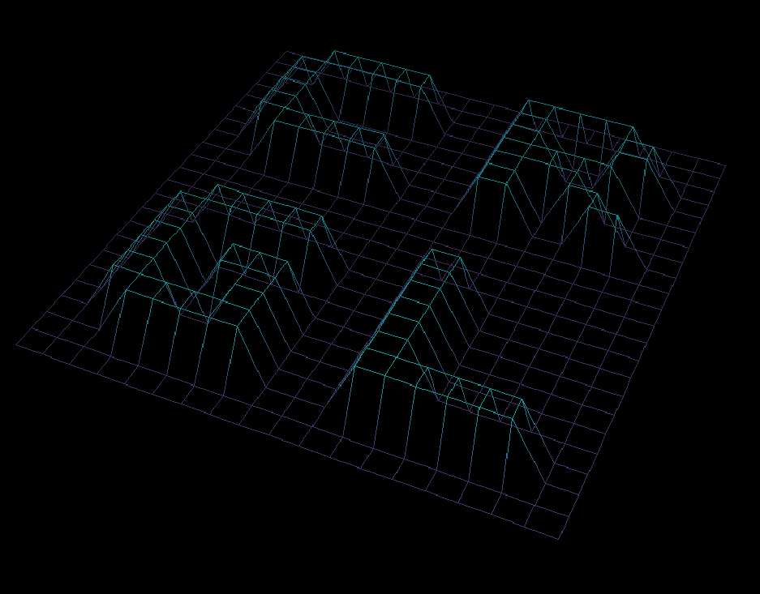

# fdf_rust
A port of fdf to Rust for easier web display of the project

## Build

For desktop:
`cargo run --release`

For browser:
`cargo web start`

You'll have to install cargo to run either of these and [cargo-web](https://docs.rs/crate/cargo-web/0.6.14) if you want to run the web version locally (I believe it won't be any faster than [this version](https://crgl.dev/rust/fdf/) though(.

## Rationale

Minilibx is a relatively 42-local graphics library, and I wrote this originally in a very homogenous environment of Macs. Since I still wanted to have access to it and it relies only on the ability to place an image on a screen, I adapted it to Rust with minimal changes (boldly ignoring [quicksilver](https://docs.rs/quicksilver/0.3.20/quicksilver/)'s line-drawing capabilities). Screenshots are perfectly alright, but the possibility of having a link to a static webpage that provided an interactive demonstration was too tempting to ignore. However, since the input format isn't that conducive to rapid prototyping and this is mostly a demonstration, it will probably continue to be restricted to just the one input file.

## A visual

Unfortunately, much like the web version, this gif is significantly jerkier than the desktop binary. I may look into the dark art of gif-making someday as a result.

